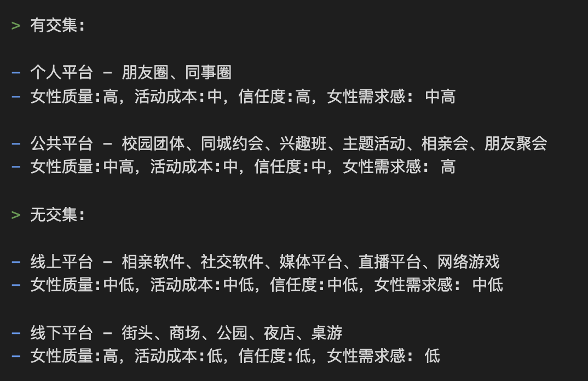

# 1.2丨为什么单身的是你——认识女生的途径

* 记录时间: 2021-10-06
* 内容来源: 来源于网络，对敏感词做了一些删减，优化并收集积极向上的内容

> 去哪里认识女人？

吸引她的第一步是先得把她找出来，那么“她”在哪里？

> 什么是目标存库？

目标存库指的是，一个男人在任何一个时刻，有进一步可能发展的女性资源。
正在求偶的单身男人应该有起码5个有机会后续发展的女性目标。
如果目标太少，就容易陷入需求感过强的陷阱，容易犯低等错误。【这就是大多数男生单身的原因】
因为缺少其它潜在选择，男人会把过多的注意力放在某一个女人身上。我们会盲目放大对方的优点，总是在患得患失的边缘徘徊。
对比而言，女生会表现的很很多，脱单的概率也高很多，一个事实原因就是选择多，也不会出现患得患失的样子。

> 脱单注意事项

脱单其实很简单，你只需要做好两个环节即可。

* 一个就是你怎么认识更多的女生。
* 另一个就是怎么吸引并留住喜欢的女生。

注意几点: 

1. 数量
2. 品质
3. 交集程度

> 认识女生渠道和质量

目前渠道分为：有交集和无交集

交集可以是你与女生的物理距离、心理、社交层面上的交织联系。
交集有利你建立信任，也多了日后再次见面的契机。
此外，社交认证、价值的传达、等等可以增加她对你的兴趣的方法，也会在有交集的关系中得以更好发挥。
无交集的认识方法，也有它的好处。
可以帮助你跨越社交圈子的限制，把你的潜在目标范围无限扩大，让你有更多选择；
此外，哪怕在你与女生的交往当中搞砸了，它也不会给你带来社交后遗症。

> 有交集

- 个人平台：朋友圈、同事圈
- 女性质量高，活动成本中，信任度高，女性需求感中高

你和好朋友相互邀约异性好友参加聚会，实现人脉的相互交换和融入，实现个人平台的最大意义。
你们可以认识更多的异性，在这些异性中，你可以选择你所喜欢并且也喜欢你的人，进行脱单。【健康也安全】
当然除了是纯粹的友谊，所有良好的社交平台都必须建立在一个好的主题之上。
好的主题不外乎吃喝玩乐，围绕着兴趣或者资源共享而存在的。
你必须要提高价值给别人，他们才会围绕在你的身边。你的僚机或者好朋友和你共同承担着发展，维持这个社交平台的职责。
比如: 可以不定期带各自认识的女生们去参加德州扑克、唱歌、户外活动聚会，让大家相互融合和彼此成全。

- 公共平台：校园团体、同城约会、兴趣班、主题活动、相亲会、朋友聚会
- 女性质量中高，活动成本中，信任度中，女性需求感高

没关系，如果你还没有自己的社交圈子，那么可以参与到别人的平台上！

> 无交集

- 线上平台：相亲软件、社交软件、媒体平台、直播平台、网络游戏
- 女性质量中低，活动成本中低，信任度中低，女性需求感中低

网络游戏这种观念场景，人们聚在一起寻找的是娱乐、轻松、和团队协作。
在这个过程，你表现出来的样子，是很能够感染到身边的人的。
而相亲/社交软件，更多的是你一对一，你要做好的是轻松无压力，并且保持可持续。

- 线下平台：街头、商场、公园、夜店、桌游
- 女性质量高，活动成本低，信任度低，女性需求感低

社交环境可以是夜店诸如此类的场合，人们聚在一起为了寻找虚荣、娱乐、交流、认识异性的地方。
凡是有交流的地方，就有社交氛围。氛围是社交场合里最为重要元素，因为人都是奔着这个氛围去的，他们要去那里“感受”这个氛围。
所以，对这个社交场合的主人来说，氛围是他们最重要的资产，因为氛围一旦被打破，那么他的付出即便付诸于流水。
作为存在于这个氛围的一份子，我们也会自觉地去保护这个氛围，毕竟我们也是出于对这个氛围的认同而去的。
如果有人突然做一些社交失态的事情，我们会给这人注目礼，给他社交压力，让他停止这种行为。
所以，在这种环境下，我们不希望用一种社交失态，过于唐突的方式去与其他人互动。
只有把握住整体环境，你才能更好的认识你想认识的异性。
相反，在日常环境中，比如说街头上、商场上、旅游时，你则需要采取相反的策略。
在这些来去匆匆的地方，人和人之间的交流基本上接近零。
所以相对来说你不需要过于担心旁人的眼光，而该把注意力放在对方身上，追求高质量的一对一互动。
只有把握住这些环境上的差异，你才能更好地展开你的脱单计划。
